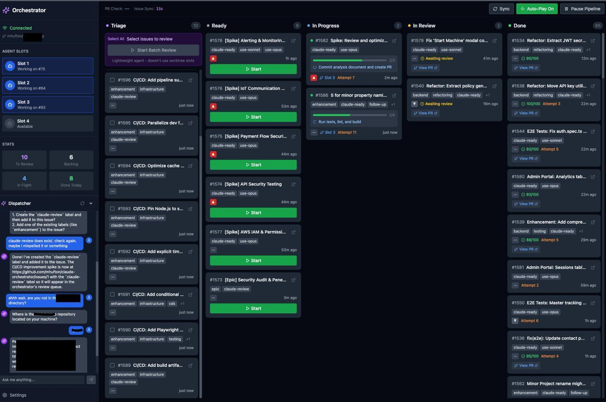

# Claude Orchestrator

A system for managing autonomous Claude AI agents that work on GitHub issues. Point it at a repository, label issues, and watch Claude implement solutions automatically using a kanban-style workflow.

## What It Does



- **Monitors GitHub** for issues with specific labels (`claude-ready`, `claude-review`)
- **Spawns Claude agents** to implement solutions in parallel (3 concurrent slots)
- **Kanban-style board** tracks issues through Triage → Ready → In Progress → In Review → Done
- **Creates PRs** and monitors CI status
- **Auto-merges** when tests pass and review score is high enough
- **Retries intelligently** with context from previous attempts
- **Real-time dashboard** to watch agents work

## Architecture

```
┌─────────────────────────────────────────┐
│         Web Dashboard (React)           │
│  - Kanban board view                    │
│  - Real-time agent logs                 │
│  - PR review interface                  │
│  - Dispatcher chat                      │
└──────────────────┬──────────────────────┘
                   │ WebSocket
┌──────────────────▼──────────────────────┐
│         Bun Server (Backend)            │
│  - GitHub sync loop                     │
│  - Agent spawner (Claude CLI)           │
│  - PR watcher                           │
│  - State machine                        │
└──────────────────┬──────────────────────┘
                   │
       ┌───────────┼───────────┐
       ▼           ▼           ▼
   Git Repos   GitHub API   Claude CLI
```

## Prerequisites

- [Bun](https://bun.sh/) 1.0+ (or Node.js 18+)
- Git with worktree support
- [Claude CLI](https://docs.anthropic.com/en/docs/claude-code) installed and authenticated
- GitHub Personal Access Token with repo access
- **Claude PR Review** configured in your target repository (see below)

## Quick Start

### 1. Clone and Install

```bash
git clone https://github.com/YOUR_USERNAME/claude-orchestrator.git
cd claude-orchestrator
bun install
```

### 2. Configure Environment

```bash
cp .env.example .env
```

Edit `.env` with your settings:

```env
# GitHub Configuration
GITHUB_TOKEN=ghp_your_token_here
GITHUB_OWNER=your-username
GITHUB_REPO=your-repo-name

# Path to the repository Claude will work on
REPO_PATH=/path/to/your/target/repo

# Labels (defaults shown)
CLAUDE_READY_LABEL=claude-ready
CLAUDE_REVIEW_LABEL=claude-review

# Server port (default: 3456)
PORT=3456
```

### 3. Initialize Database

```bash
bun run server/db/init.ts
```

### 4. Run

```bash
# Run both server and web dashboard
bun run dev
```

- **Dashboard**: http://localhost:5173
- **API/WebSocket**: http://localhost:3456

## How It Works

### Ticket Lifecycle

```
Issue created with label
        ↓
   needs_review ──→ Human reviews scope
        ↓
     backlog ──→ Waiting for available slot
        ↓
   in_progress ──→ Claude agent working
        ↓
    in_review ──→ PR created, CI running
        ↓
      done ──→ PR merged, issue closed
```

### Labels

| Label | Purpose |
|-------|---------|
| `claude-review` | Issue needs human review before work starts |
| `claude-ready` | Issue is ready for Claude to work on |
| `use-opus` | Force use of Claude Opus model |
| `use-sonnet` | Force use of Claude Sonnet model |

### Model Selection

By default:
- **Sonnet** for first 2 attempts (faster, cheaper)
- **Opus** for 3+ attempts (more capable for complex issues)

Override with `use-opus` or `use-sonnet` labels.

## Dashboard Features

### Kanban Board
Five columns showing ticket status:
- **Needs Review** - Issues needing human review
- **Ready** - Backlog ready for agents
- **In Progress** - Agents actively working
- **In Review** - PRs awaiting merge
- **Done** - Completed today

### Agent Logs
Click any in-progress ticket to see:
- Real-time streaming output
- Tool calls and results
- Task tracking (from TodoWrite)

### Dispatcher Chat
AI assistant (Sonnet) that can:
- Query GitHub issues and PRs
- Add labels to issues
- Help manage the pipeline

### Controls
- **Pause Pipeline** - Stop spawning new agents
- **Sync** - Refresh from GitHub
- **Stop** - Kill running agent
- **Retry** - Respawn agent on failed ticket

## Project Structure

```
claude-orchestrator/
├── server/                 # Backend (Bun)
│   ├── agents/
│   │   ├── spawner.ts     # Spawns Claude CLI
│   │   ├── dispatcher.ts  # Chat interface
│   │   ├── reviewer.ts    # Batch review
│   │   └── prompts.ts     # Agent prompts
│   ├── github/
│   │   ├── client.ts      # GitHub API
│   │   ├── issues.ts      # Issue sync
│   │   └── pr-watcher.ts  # PR monitoring
│   ├── state/
│   │   └── machine.ts     # Ticket state machine
│   ├── db/
│   │   └── schema.sql     # Database schema
│   └── ws/
│       └── handler.ts     # WebSocket handlers
│
├── web/                    # Frontend (React + Vite)
│   └── src/
│       ├── components/    # UI components
│       ├── stores/        # Zustand state
│       └── hooks/         # React hooks
│
└── orchestrator.db        # SQLite database (auto-created)
```

## Configuration

### Environment Variables

| Variable | Required | Default | Description |
|----------|----------|---------|-------------|
| `GITHUB_TOKEN` | Yes | - | GitHub PAT with repo access |
| `GITHUB_OWNER` | Yes | - | Repository owner |
| `GITHUB_REPO` | Yes | - | Repository name |
| `REPO_PATH` | Yes | - | Local path to target repo |
| `PORT` | No | 3456 | Server port |
| `CLAUDE_READY_LABEL` | No | claude-ready | Label for ready issues |
| `CLAUDE_REVIEW_LABEL` | No | claude-review | Label for review issues |
| `WORKTREE_DIR` | No | ./worktrees | Git worktree directory |
| `ISSUE_SYNC_INTERVAL` | No | 60000 | GitHub sync interval (ms) |
| `PR_WATCH_INTERVAL` | No | 120000 | PR check interval (ms) |

### Worktrees

The orchestrator uses 3 parallel git worktrees for concurrent agent execution. These are created automatically in the `WORKTREE_DIR` directory.

## Claude PR Review Setup (Required)

The orchestrator relies on automated PR reviews to determine when work is complete. You must configure Claude to review PRs in your target repository.

### How It Works

1. Agent creates a PR
2. **Claude reviews the PR** and posts a comment with a score (0-100)
3. Orchestrator parses the score from the review comment
4. If score >= 90 and CI passes → auto-merge
5. If score < 90 → respawn agent with review feedback

### Setting Up PR Reviews

You need to configure a GitHub Action or similar CI step that runs Claude to review PRs. The review comment **must** include a score in this format:

```
Score: 85/100
```

Or:
```
**Score:** 92/100
```

### Example GitHub Action

Create `.github/workflows/claude-review.yml` in your target repository:

```yaml
name: Claude PR Review

on:
  pull_request:
    types: [opened, synchronize, reopened]

jobs:
  review:
    runs-on: ubuntu-latest
    steps:
      - uses: actions/checkout@v4
        with:
          fetch-depth: 0

      - name: Setup Claude CLI
        run: |
          # Install Claude CLI (adjust based on your setup)
          npm install -g @anthropic-ai/claude-code

      - name: Review PR
        env:
          ANTHROPIC_API_KEY: ${{ secrets.ANTHROPIC_API_KEY }}
          GITHUB_TOKEN: ${{ secrets.GITHUB_TOKEN }}
        run: |
          # Get the diff
          git diff origin/${{ github.base_ref }}...HEAD > /tmp/diff.txt

          # Run Claude review
          claude --print "Review this PR diff and provide:
          1. A score out of 100 based on code quality, test coverage, and correctness
          2. Key issues to fix (if any)
          3. The score should be >= 90 if the code is production-ready

          Format your response with:
          Score: XX/100

          Then list any issues.

          Diff:
          $(cat /tmp/diff.txt)" > /tmp/review.txt

          # Post review as PR comment
          gh pr comment ${{ github.event.pull_request.number }} --body "$(cat /tmp/review.txt)"
```

### Review Score Threshold

The orchestrator uses a **90/100** threshold:

| Score | Action |
|-------|--------|
| >= 90 | Auto-merge if CI passes |
| < 90 | Respawn agent with feedback |

The agent receives the review feedback and is instructed to fix the issues before pushing again.

### What Claude Should Review

Configure your review prompt to check:
- **Tests pass** - Most important, biggest point deduction if failing
- **Code quality** - Clean, readable, follows project conventions
- **No regressions** - Existing functionality isn't broken
- **Security** - No obvious vulnerabilities
- **Scope** - Changes match the issue being fixed

## Database

SQLite database stores:
- Ticket state and metadata
- Agent logs (streaming output)
- Task tracking (TodoWrite events)
- Review results and scores

Reset database:
```bash
rm orchestrator.db*
bun run server/db/init.ts
```

## Development

```bash
# Run server only
bun run dev:server

# Run web only
bun run dev:web

# Build for production
bun run build
```

## Troubleshooting

### Agent stuck on "Thinking..."
- Check server logs for errors
- Ensure Claude CLI is authenticated (`claude --version`)
- Try stopping and retrying the ticket

### Issues not syncing
- Verify `GITHUB_TOKEN` has repo access
- Check labels match configuration
- Look for GitHub API errors in server logs

### PR not auto-merging
- Requires review score >= 90%
- All CI checks must pass
- Branch must be up to date with base

## Security Notes

For production use, consider:
- Adding authentication to WebSocket endpoint
- Restricting CORS to specific origins
- Setting database file permissions to 600
- Using environment-specific tokens

## License

MIT
